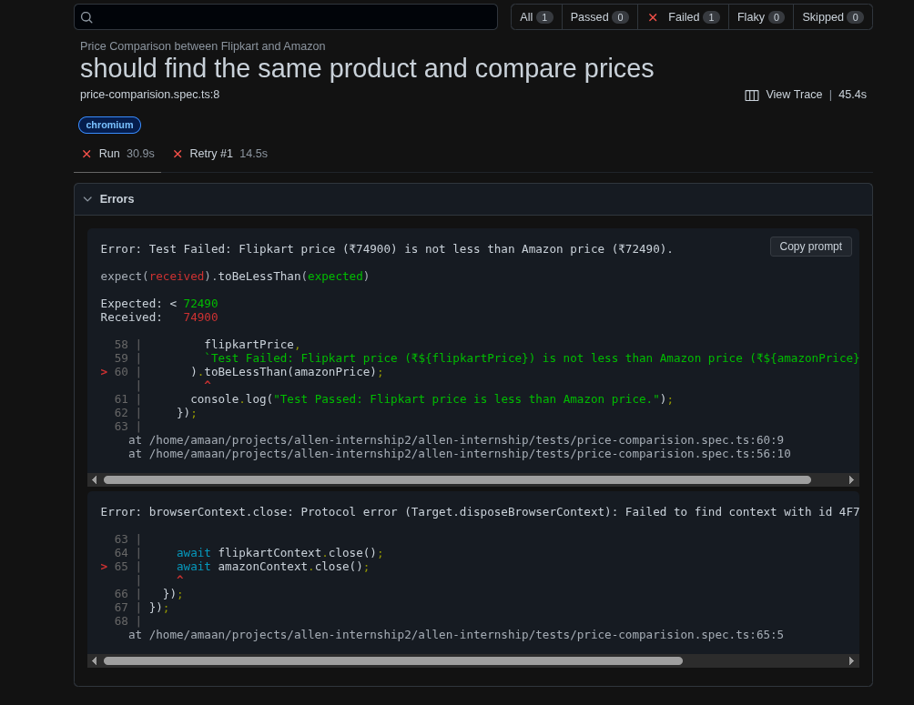

# Flipkart vs Amazon Price Comparison

This project implements an end-to-end automated test using Playwright and TypeScript to compare product prices between Flipkart and Amazon.

## 🎯 Objective

The test automates the process of:

1. Navigating to both Flipkart and Amazon
2. Validating page URLs and titles
3. Searching for "iPhone 15 Plus" on both sites
4. Extracting product prices
5. Comparing prices and determining the cheaper option
6. Passing/failing based on whether Flipkart has a lower price

## 🚀 Features

- **Parallel Execution**: Both sites are accessed simultaneously using separate browser contexts
- **Robust Price Extraction**: Handles different price formats and currency symbols
- **Comprehensive Validation**: Multiple assertions for URLs, titles, products, and prices
- **Error Handling**: Detailed error messages and debugging screenshots
- **Trace Support**: Full Playwright trace support for debugging failures
- **TypeScript**: Fully typed implementation with proper interfaces

``` bash
npm test
```


